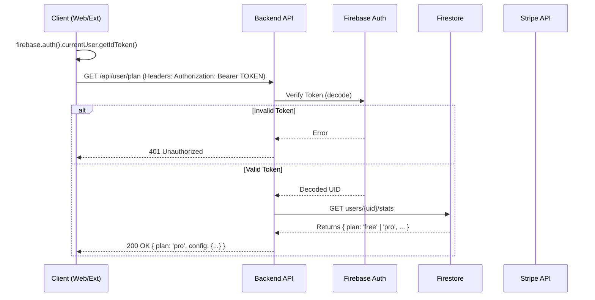
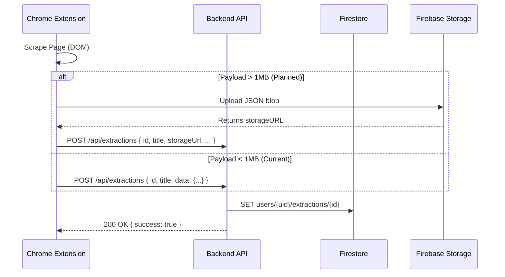
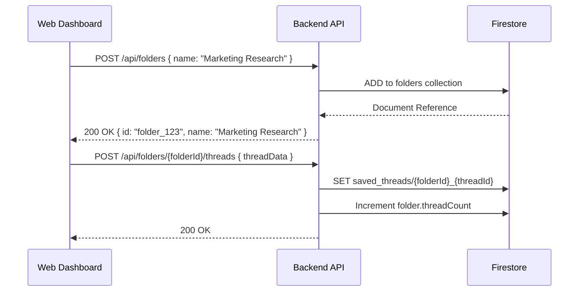
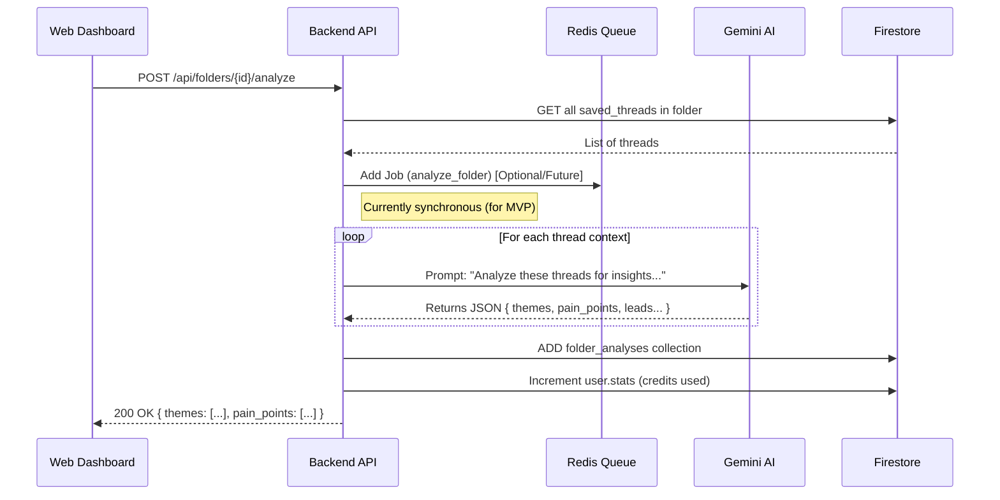
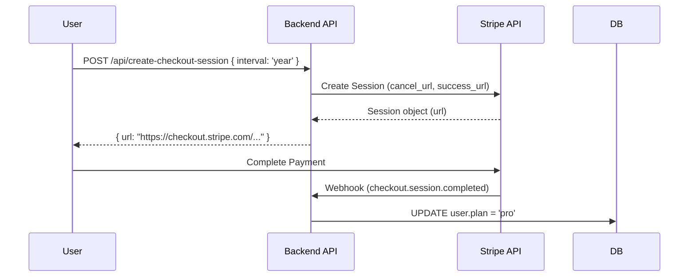

# OpinionDeck API Sequence Diagram

This document illustrates the interactions between the Client (Web App + Extension), the Backend API, and external services (Firebase, Stripe, Gemini, Redis).

## 1. Authentication & User Profile

## 2. Core Data Flow: Extractions (Extension)

## 3. Organizing: Folders & Threads

## 4. Intelligence: AI Analysis

## 5. Payments: Upgrade Flow

